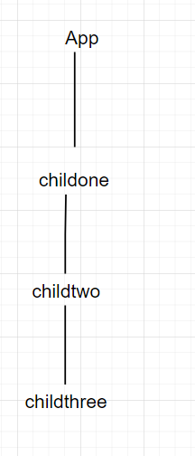

# Angular - The Basics - Exercises

**Use Git or GitHub Desktop to push each exercise to GitHub**

_NOTE_: Make projects all non-strict mode

---

---

## Exercise 1: Create nested components

- Create a new angular project called `create-nested-components`
- Generate three components: `child-one`, `child-two`, `child-three`
- Edit `child-one's` template, create a paragraph element with the content "I'm the app component's child!"
- Edit `child-two's` template, create a paragraph element with the content "I'm child-one's child!"
- Edit `child-three's` template, create a paragraph element with the content "I'm the child-two's child!"
- Nest `child-one` into app component
- Nest `child-two` into `child-one`
- Nest `child-three` into `child-two`
- Run `ng serve` in the terminal, and you should see the template of each component rendered onto the webpage

---

## Exercise 2: Create complex structure components

- Create a new angular project called `create-complex-structure`
- Generate a component structure that looks similar to the diagram
- Run `ng serve` in the terminal, and you should see the template of each component rendered

---

## Exercise 3: Use string interpolation to output content to the webpage

- Create a new angular project called `string-interpolation-exercise`
- Create a variable in `app.component.ts` called "name", set its type to string, and make it equal to your name(for exercise: "John")
- Create a paragraph element and use string interpolation to output the name value
- Run `ng serve` in the terminal, and you should see your name on the webpage

---

## Exercise 4: Use string interpolation to output the values an object holds

- Create a new angular project called `string-interpolation-object`
- Generate a component called post
- Nest the post component in the app component
- In `app.component.ts`, create a class property called heading with a type string and set it equal to "user post"
- In `app.component.ts`, create a class property called num with a type number and set it equal to 1
- In the `app.component.html` file, create an h1 element with the content of both class properties heading and num
- In the `post.component.ts`, create a class property called `info` that is an object with properties: `firstName` and `lastName`. Fill in the values for these properties
- Use string interpolation to output these properties values from the object.
- Run `ng serve` in the terminal to see the object's values onto the page, along with the heading and num.

---

## Exercise 5: Use a ternary operator to output content dynamically

- Create a new angular project called `ternary-operator-string-interpolation`
- Generate a component called `navbar` and nest it in the app component
- In navbar.component.ts, create a property called `loggedIn` with type `boolean` and set it equal to true
- In `navbar.component.html`, create a div element; in the div element, use string interpolation to output "I am logged in!" if the `loggedIn` class property is true; otherwise, output "I am logged out!"

_NOTE:_ example of ternary operator: `true ? "output if true" : "output if false"`

---

## Exercise 6: Use property binding to disable an input element

- Create a new angular project called `basic-property-binding`
- In `app.component.ts`, create a class property called `isDisabled` with type boolean and set it equal to true
- In `app.component.html`, create an input element and use property binding to bind the html attribute disabled (see reference of what it is) to the set class property `isDisabled`
- run `ng serve`. If it works, you should not be able to type anything in the input field
- now set `isDisabled` to false then run `ng serve`, and you should be able to type in the input field

Reference: https://www.w3schools.com/tags/tag_input.asp

---

---

## Exercise 7: Blog Demo

1. Generate a new Angular project (with strict mode disabled). Name it "angular-basics-exercise".

2. Manually create a component called "article".

3. In the article component, create variables `title: string = "Whatever you want"` and `content: string = "Some content goes here"`.

4. Use string interpolation to output the title in an h1 element and the content in a paragraph element. (Note: you can google 'lorem ipsum generator ' to generate dummy text).

5. Display the article component by adding it in the main "app.component.html" file.

6. In the article component, add another variable: `isTechRelated: boolean = true`.

7. Use "ngStyle" to change the background of the h1 element to blue when "isTechrelated" is true; Otherwise, it should be yellow.

8. Push your local repository to GitHub, call the repo 'angular-basics-exercise'.

**Bonus**: In the article component, create a button with the content "change isTechRelated". (Use event binding to reverse the variable "isTechRelated" value whenever a user clicks the button).

**Bonus**: In the article component, use "ngIf" to display a paragraph element with content "Tech Related" when the "isTechRelated" is true. When false, use the ng-template element to display "Not Tech Related".
