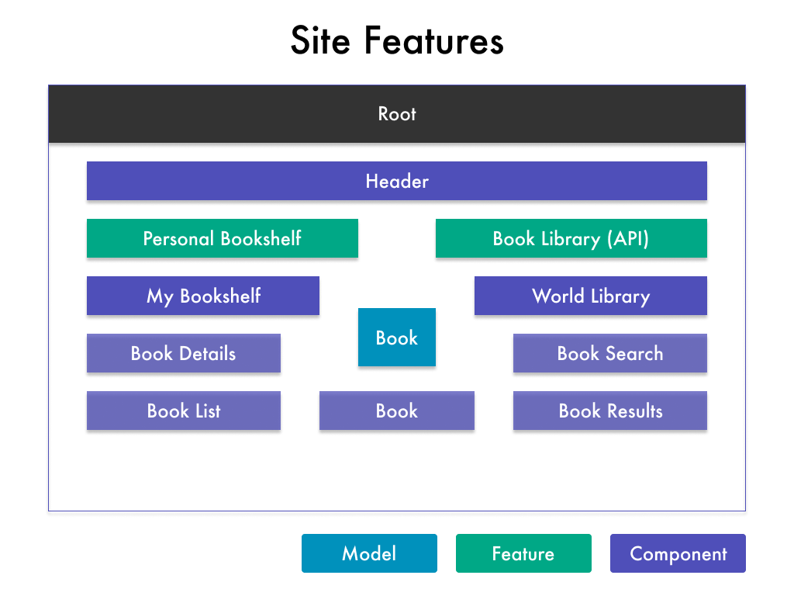
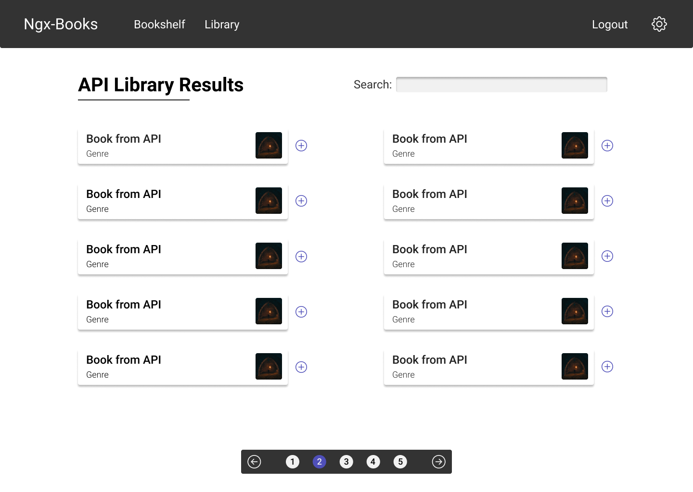

# Class 13 - Course Basics && Debugging

[Class 13 Course Content](https://pro.academind.com/courses/765847/lectures/13901423)

## Lesson Outline

Today we will learn:

1. How to plan an application.
2. How to create an intuitive folder structure.
3. How to create a bootstrap navigation bar.
4. How to create a (book) model.

Furthermore, we will solidify our knowledge in:

1. Using the Angular CLI.
2. Creating components.
3. Adding simple styles to our project.
4. Common Bootstrap classes.

---

---

## Lesson Notes

### Applications Outline

#### FEATURES

- **Personal Bookshelf**: Create, Read, Update, Delete Books in our collection.

- **Book Library**: Pulling book data from an API.



#### COMPONENTS

##### Shared Components

- **Root**: Contains all of our Applications components.

- **Header**: Provides navigation for our app.

- **Book**: Display a singular book object across multiple pages.

##### Independent Components

- **My Bookshelf**: All logic, styles, and markdown for the bookshelf page.

  - **Book List**: List of all books in our collection.

  - **Book Details**: Expanded details about a single book.

- **World Library**: All logic, styles, and markdown for the library page.

  - **Book Results**: List of all the books from the search result.

  - **Book Search**: Search bar markup and logic to call our API.

---

#### DESIGN / UI FLOW

1. User signs up or signs in.
2. User fetches book from a database.
3. User edits personal books.
4. User pulls from the database to add more books.




---

---

## Components & Databinding Project Steps

### STEP 1: Start a New Project Using the Angular CLI

_Terminal_:

- Navigate to the folder you want to create your project in.

```zsh
ng new BookIt --no-strict
```

- Install Bootstrap 4. (Make sure you are in the correct folder inside the terminal).

```zsh
cd BookIt

npm i bootstrap@4
```

_angular.json file_:

- Inside the styles array and above the first style declaration, import `node_modules/bootstrap/dist/css/bootstrap.min.css`.

- Run ng serve.

_app.component.html_:

- Clear all the HTML.

- Test that Bootstrap is working by adding a container div with a row and column inside.

```html
<div class="container">
  <div class="row">
    <div class="col-md-10 mx-auto">
      <h1>BookIt</h1>
    </div>
  </div>
</div>
```

---

### STEP 2: Create a File Structure by Adding All of Our Components

_Terminal_:

- Create the two main components using the CLI

```zsh
ng g c --skip-tests=true bookshelf

ng g c --skip-tests=true library
```

- Walkthrough the components. Double-check they are correctly imported in the `app.module.ts` file.

- Create the rest of our components

```zsh
ng g c --skip-tests=true bookshelf/book-list

ng g c --skip-tests=true bookshelf/book-details

ng g c --skip-tests=true library/book-results

ng g c --skip-tests=true library/book-search

ng g c --skip-tests=true shared/navigation

ng g c --skip-tests=true shared/book
```

---

### STEP 3: Displaying Our Core Components

_app.component.html_:

- Place the newly created navigation tag inside the main app container. (We are getting this tag from the `shared/navigation/navigation.component.ts` component selector).

```html
<div class="container">
  <app-navigation></app-navigation>
  <!-- ... -->
</div>
```

- Add the `<app-bookshelf>` and `<app-library>` component selectors inside a column, separated by an `<hr />` tag. Explain how eventually, these components will each be a feature and on an individual page. (For now, they will be displayed on the same page until we learn Angular Routing.)

```html
<div class="container">
  <app-navigation></app-navigation>
  <div class="row">
    <div class="col-md-10 mx-auto">
      <app-bookshelf></app-bookshelf>
      <hr />
      <app-library></app-library>
    </div>
  </div>
</div>
```

---

### STEP 4: Display All of Our Components

_bookshelf/bookshelf.component.html_:

- Add the `<book-list>` and `<book-details>` components side their own bootstrap columns.

```html
<div class="row justify-content-between">
  <div class="col-md-6">
    <h1>My Saved Books</h1>
    <app-book-list></app-book-list>
  </div>
  <div class="col-md-6">
    <app-book-details></app-book-details>
  </div>
</div>
```

_bookshelf/book-list/book-list.component.html_:

- Create a row and column that contains three `<app-book>` components. (Explain how eventually, we will not "hard-code" the number of books in this column because it will be dynamic!)

```html
<div class="row mb-3">
  <div class="col-md-12">
    <app-book></app-book>
    <app-book></app-book>
    <app-book></app-book>
  </div>
</div>
```

_library/library.component.html_:

- Create a row with two columns. One column should hold the title, the other the book search. (This is our top row).

- Create another row that takes the entire width and displays the `<book-results>`.

```html
<div class="row">
  <div class="col-md-6">
    <h1>API Library Results</h1>
  </div>
  <div class="col-md-6">
    <app-book-search></app-book-search>
  </div>
</div>
<div class="row">
  <div class="col-md-12">
    <app-book-results></app-book-results>
  </div>
</div>
```

_library/book-results/book-results.component.html_:

- Do the same thing you did in the book-list component. These will end up displaying similarly.

```html
<div class="row mb-3">
  <div class="col-md-12">
    <app-book></app-book>
    <app-book></app-book>
    <app-book></app-book>
  </div>
</div>
```

---

### STEP 5: Adding Bootstrap Navigation

_shared/navigation/navigation.component.html_:

- Navigate to the Boostrap 4 documentation for Navbars.

  - [Boostrap 4 Navigation](https://getbootstrap.com/docs/4.0/components/navbar/#nav)

- Copy and paste the one most similar to what we will be using.

- Change the links and text to fit our application.

```html
<nav class="navbar navbar-dark bg-dark navbar-expand-lg mb-4">
  <a class="navbar-brand brand" id="brand" href="#">BookIt</a>
  <button
    class="navbar-toggler"
    type="button"
    data-toggle="collapse"
    data-target="#navbarToggler"
    aria-label="Toggle navigation"
    aria-controls="navbarToggler"
    aria-expanded="false"
    (click)="collapsed = !collapsed"
  >
    <span class="navbar-toggler-icon"></span>
  </button>

  <div
    class="collapse navbar-collapse"
    id="navbarToggler"
    [class.collapse]="collapsed"
    (window:resize)="collapsed = true"
  >
    <ul class="navbar-nav mr-auto mt-2 mt-lg-0">
      <li class="nav-item">
        <a class="nav-link" href="#">Bookshelf</a>
      </li>
      <li class="nav-item">
        <a class="nav-link" href="#">Library</a>
      </li>
    </ul>
    <ul class="navbar-nav">
      <li class="nav-item dropdown">
        <a
          class="nav-link dropdown-toggle"
          href="#"
          id="navbarDropdownMenuLink"
          data-toggle="dropdown"
          aria-haspopup="true"
          [attr.aria-expanded]="show"
          (click)="show = !show"
          [class.show]="show"
        >
          Settings
        </a>
        <div
          class="dropdown-menu"
          aria-labelledby="navbarDropdownMenuLink"
          [class.show]="show"
        >
          <a class="dropdown-item" href="#">Save Data</a>
          <a class="dropdown-item" href="#">Fetch Data</a>
        </div>
      </li>
    </ul>
  </div>
</nav>
```

- Add two variables to the navigation typescript file.

```typescript
collapsed: boolean = true;
show: boolean = false;
```

---

### STEP 6: Create the Book Model

_shared/book/book.model.ts_:

- Create the `book.model.ts file`. (Explain that a model is a representation of data. We use these so every instantiation of a book will be forced to hold all the data we need to make the application function correctly).

- Create the book model class.

```typescript
export class Book {
  constructor(
    public title: string,
    public author: string,
    public genre: string,
    public coverImagePath: string
  ) {}
}
```

---

### STEP 7: Using Our Book Model

_bookshelf/book-list/book-list.component.ts_:

- Add a new `myBooks` array and fill it with a dummy book. (Make sure you import the Book Model).

```ts
myBooks: Book[] = [
    new Book(
        'Book of Testing',
        'Will Wilder',
        'Mystery',
        'https://source.unsplash.com/50x50/?mystery,book'
    )
];
```

_bookshelf/book-list/book-list.component.html_:

- Delete the 3 Books we entered earlier.

- Add `*ngFor` on the main row div to loop over all the books inside the `myBooks` array we just created.

- Add text interpolation for the title, genre, and image.

```html
<div class="row mb-3" *ngFor="let book of myBooks">
  <div class="col-md-12">
    <a href="#" class="list-group-item clearfix">
      <div class="float-left">
        <h4 class="list-group-item-heading">{{ book.title }}</h4>
        <p class="list-group-item-text mb-0">{{ book.genre }}</p>
      </div>
      <div class="float-right">
        
      </div>
    </a>
  </div>
</div>
```

- Copy two more test books in our `myBooks` array.

- Add a row beneath the looped row that contains a button to `Add A New Book`.

```html
<!-- . . . -->
<hr />

<div class="row">
  <div class="col-md-12">
    <button class="btn btn-primary">Add New Book</button>
  </div>
</div>
```

_library/book-results/book-results.component.ts_:

- Add an array similar to the one we did for the book-list, and fill it with a few dummy books. (Mention how you changed the variable to `allBooks` because it is more fitting/descriptive in this case).

```ts
allBooks: Book[] = [
    new Book(
        'Book of Testing',
        'Will Wilder',
        'Mystery',
        'https://source.unsplash.com/50x50/?mystery,book'
    ),
    // . . .
];
```

_library/book-results/book-results.component.html_:

- Copy the top row from the book-list.html file we just created and paste it here.

- Change the `*ngFor` to loop over the `allBooks` array.

```html
<div class="row mb-3" *ngFor="let book of allBooks">
  <div class="col-md-12">
    <a href="#" class="list-group-item clearfix">
      <div class="float-left">
        <h4 class="list-group-item-heading">{{ book.title }}</h4>
        <p class="list-group-item-text mb-0">{{ book.genre }}</p>
      </div>
      <div class="float-right">
        
      </div>
    </a>
  </div>
</div>
```

---

### STEP 8: Creating Book Details Component Structure

_bookshelf/book-details/book-details.component.html_:

- Add a row and column for the Title, Author, Genre, Image, Tags, and Edit book button.

```html
<div class="row">
  <div class="col-md-12">
    <h2>Book Title</h2>
  </div>
</div>

<div class="row">
  <div class="col-md-12">
    <h3>Author</h3>
  </div>
</div>

<div class="row">
  <div class="col-md-12">
    <p>Genre</p>
  </div>
</div>

<div class="row">
  <div class="col-md-12">
    
  </div>
</div>

<div class="row">
  <div class="col-md-12">
    <small>Tags</small>
  </div>
</div>

<hr />

<div class="row">
  <div class="col-md-12">
    <button type="button" class="btn btn-primary">Edit Book</button>
  </div>
</div>
```

---

---

## Debugging an (Angular) Application

### Debugging Process

1. Read the error message carefully.
2. Check for any red underlines in your code.
3. Use the console.log() statement to determine if your variables are holding the values you suspect they should.
4. Read through your logic line-by-line, making sure you understand what is going on the whole way through.
5. Google your error as explicitly as possible.
6. Use the Chrome/VSCode Debugger tool.
   - Open developer tools.
   - Open the "source" panel.
   - Click "webpack".
   - Click "src".
   - Find your file.
   - Add breakpoints.
7. Ask a fellow developer/student.
8. Post on StackOverflow... _heh, maybe not_
9. Ask a code coach! We are here to help.

---

---

## Extra Credit/Time - (Instructors Push these to Github!)

### STEP 1: Adding a Google Font

- Navigate to the google fonts website.

  - [Google Fonts](https://fonts.google.com/)

- Search "Roboto".

- Add the styles you want: "light, regular, medium, bold".

- Copy the link.

_index.html_:

- Paste the link in the head of your document.

```html
<head>
  <!-- ... -->
  <link rel="preconnect" href="https://fonts.googleapis.com" />
  <link rel="preconnect" href="https://fonts.gstatic.com" crossorigin />
  <link
    href="https://fonts.googleapis.com/css2?family=Roboto:wght@300;400;500;700&display=swap"
    rel="stylesheet"
  />
</head>
```

_styles.css_:

- In the root styles, add your font-family to the elements you want to use.

```css
html,
body,
input,
label,
button,
a {
  font-family: "Roboto", sans-serif;
  font-weight: 400;
}
h1 {
  font-size: 2rem;
  font-weight: 700;
}

h2 {
  font-weight: 500;
}

p,
small,
span {
  font-weight: 300;
}
```

---

### STEP 2: Adding More Styles

_angular.json file_:

- Add the `.scss` extension to our root styles import.

_styles.scss_:

- Change the `styles.css` file extension to be `styles.scss`

- Add Boostrap and import and our themed styles

```scss
$primary: #4f4fb9;
$black: #222;
$white: #f1f1f1;
@import "bootstrap";
```

_shared/navigation/navigation.component.css_:

- Add styles for our navbar, brand text, and anchor links.

```css
nav {
  padding: 1.75em;
  border-bottom-left-radius: 4px;
  border-bottom-right-radius: 4px;
}

#brand {
  font-weight: 500;
  font-size: 1.5rem;
  margin: 0 1.25em 0 0;
}

nav a {
  font-size: 1.25rem;
  margin-right: 0.75em;
}
```

---

---

## Additional Notes

### Class Exercise

- Think of 3 topics/subjects you are interested in.

- For each idea, ask yourself: "What application could I create that would make _mySubject_ easier, faster, or more fun?"

- Talk with your fellow classmates.

- Decide on a project idea! (Your project should have the functionality to: CREATE data, READ data, UPDATE data, and DELETE data.)

---

### Resources

[Angular App Style Guide](https://github.com/mgechev/angularjs-style-guide/blob/master/README.md)

- [Blog - How to Come Up with a Side Project](https://blog.producthunt.com/how-to-come-up-with-side-project-ideas-4a2c8049deba)
